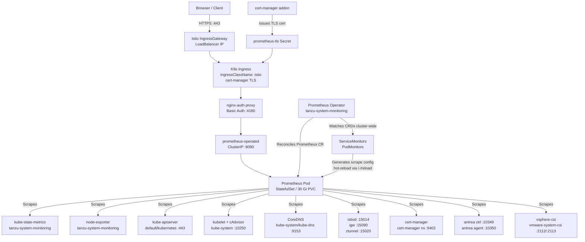

# vks-prometheus-operator

The following diagram shows the three logical planes of the deployed stack: how traffic flows in from a browser, how the Operator manages the Prometheus instance, and how Prometheus reaches all its scrape targets.

